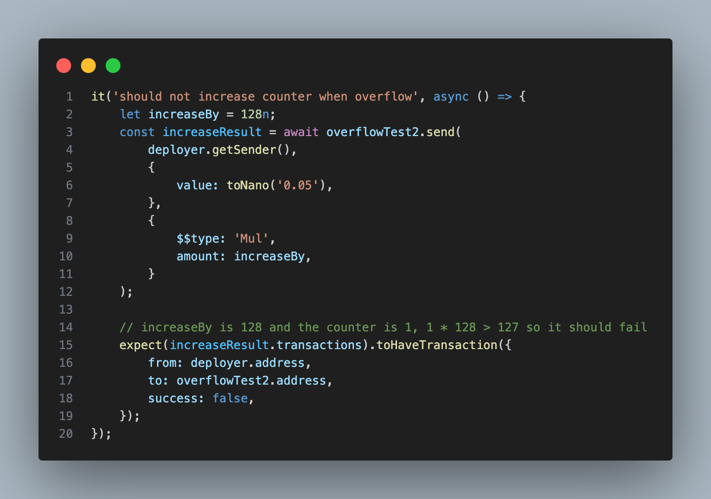

# ton-overflow

## Overflow Test

1. Tact itself detects whether a variable overflows, but this is limited only to the variable types provided by Tact, such as Int as uint8 (uint64, uint128, etc.)
```
    counter: Int as uint8;

    init() {
        self.counter = 1;
    }

    receive(msg: Mul) {
        let amount: Int = msg.amount; // msg.amount = 256
        self.counter = (self.counter * amount); // 1 * 256 > 255 -> tx will fail
    }
```


2. If you want to perform overflow detection for a specific Int type, you can do so through the following method.

stdlib-ext.fc
```
int check_fits_u7(int) asm "7 UFITS"; // You can change 7 to the number you want to detect overflow (number >= 2 ** 7 will be overflow)
```
FloatTest.tact
```
import "./imports/stdlib-ext.fc";

@name(check_fits_u7)
extends native checkU7(self: Int): Int;

    .
    .
    .

    receive(msg: Mul) {
        let amount: Int = msg.amount.checkU7(); // msg.amount = 128
        self.counter = (self.counter * amount).checkU7(); // 1 * 128 > 127 -> tx will fail
    }
```



## Project structure

-   `contracts` - source code of all the smart contracts of the project and their dependencies.
-   `wrappers` - wrapper classes (implementing `Contract` from ton-core) for the contracts, including any [de]serialization primitives and compilation functions.
-   `tests` - tests for the contracts.
-   `scripts` - scripts used by the project, mainly the deployment scripts.

## How to use

### Build

`npx blueprint build` or `yarn blueprint build`

### Test

`npx blueprint test` or `yarn blueprint test`

### Deploy or run another script

`npx blueprint run` or `yarn blueprint run`

### Add a new contract

`npx blueprint create ContractName` or `yarn blueprint create ContractName`
# Tact-Overflow-Test
